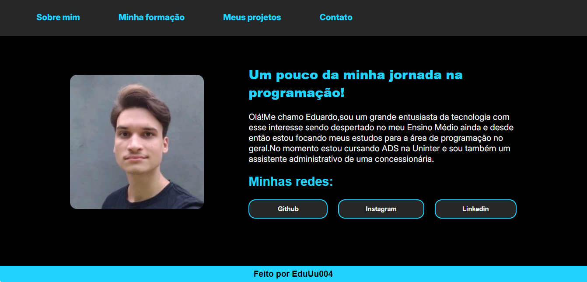

<h1 align="center">Meu portfólio pessoal</h1>
<h1 align="center">
  
</h1>

<h2>Descrição do Projeto</h2>

Repositório dedicado para meus projetos pessoais,trajetória de carreira e minha formação pessoal

### 🛠 Tecnologia
As seguinte ferramenta foi usada na construção do projeto:
- [HTML](https://www.w3schools.com/html/default.asp)
- [CSS](https://www.w3schools.com/css/css_intro.asp)
- [JavaScript](https://www.w3schools.com/js/default.asp)

### Features

- [x] Sobre mim 
- [x] Formação 
- [x] Projetos pessoais

<h3 align="center"> 
	🚧  Portfólio 🚀 Em andamento...  🚧
</h3>
